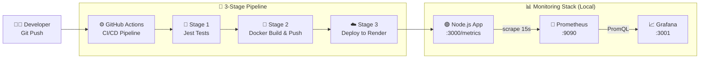
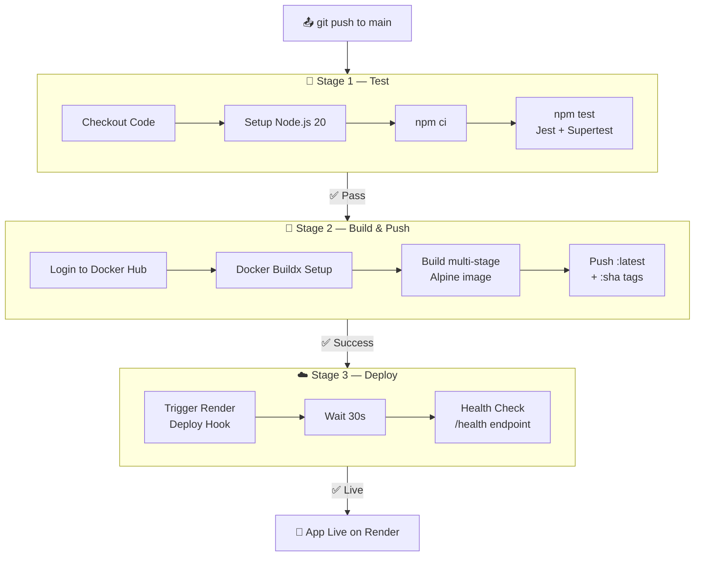

<div align="center">

# 🚀 CI/CD Pipeline Automation
### with Docker & Cloud Deployment

*A production-grade DevOps pipeline — from code push to cloud in under 5 minutes*

<br/>


<br/>

[](https://github.com/underratedgitter/CI-CD-Pipeline-Automation-with-Docker-Cloud-Deployment/commits/main)
[](https://github.com/underratedgitter/CI-CD-Pipeline-Automation-with-Docker-Cloud-Deployment)
[](https://github.com/underratedgitter/CI-CD-Pipeline-Automation-with-Docker-Cloud-Deployment/stargazers)

</div>

---

## 📌 Overview

A **production-ready CI/CD pipeline** that automates the full software delivery lifecycle — from code push to cloud deployment — using **GitHub Actions**, **Docker**, and **Render**. Features real-time observability with **Prometheus** metrics collection and **Grafana** dashboards.

```bash
# Clone and run in 3 steps
git clone https://github.com/underratedgitter/CI-CD-Pipeline-Automation-with-Docker-Cloud-Deployment.git
cd CI-CD-Pipeline-Automation-with-Docker-Cloud-Deployment
docker-compose up --build
```

---

## ✨ Key Features

| Feature | Details |
|:---|:---|
| 🧪 **Automated Testing** | Jest + Supertest on every push |
| 🐳 **Multi-stage Docker Build** | Minimal Alpine image, non-root user, layer caching |
| 🔄 **3-Stage CI/CD Pipeline** | Test → Build & Push → Deploy (< 5 min) |
| 🔐 **Zero Hardcoded Secrets** | GitHub Encrypted Secrets throughout |
| 🏷️ **SHA-tagged Images** | Full rollback traceability |
| 📊 **Live Monitoring** | Prometheus scraping + Grafana dashboards |
| 🚨 **Alerting** | 5 alert rules for app health, errors, latency, memory |

---

## 🏗️ Architecture



---

## 🛠️ Tech Stack

| Layer | Technology | Purpose |
|:---|:---|:---|
| **Runtime** |  Express.js | REST API server |
| **Testing** |  + Supertest | Unit & integration tests |
| **Containerisation** |  Multi-stage Alpine | Minimal, secure images |
| **CI/CD** |  | Automated pipeline |
| **Registry** |  | Image storage & versioning |
| **Cloud** |  | Cloud deployment |
| **Metrics** |  | Metrics collection |
| **Dashboards** |  | Visualisation & alerting |

---

## 🔄 CI/CD Pipeline



---

## 📊 Monitoring Stack

Real-time observability powered by **Prometheus** + **Grafana** running locally via Docker Compose.

### Grafana Dashboard — Node.js App Overview

| Row | Panels |
|:---|:---|
| 🟢 **Traffic & Throughput** | Request Rate (req/s), Status Code Breakdown, Active Requests, 5xx Count, Uptime |
| 🔴 **Latency** | P50 / P95 / P99 Response Time Percentiles |
| 🟡 **Memory & CPU** | Heap Used vs Total, RSS, CPU Usage % |
| 🔵 **Runtime Health** | Event Loop Lag, Garbage Collection Duration |

### Alert Rules

| Alert | Triggers When |
|:---|:---|
| `AppDown` | Prometheus can't reach `/metrics` |
| `HighErrorRate` | > 5% of requests return 5xx |
| `HighLatencyP99` | P99 latency > 1 second |
| `HighHeapUsage` | Heap memory > 85% full |
| `HighEventLoopLag` | Event loop lag > 100ms |

---

## 📁 Project Structure

```
📦 CI-CD-Pipeline-Automation-with-Docker-Cloud-Deployment
├── 📄 app.js                          # Express API + Prometheus instrumentation
├── 📄 package.json                    # Dependencies (prom-client, express, jest)
├── 🐳 Dockerfile                      # Multi-stage Alpine build
├── 🐳 docker-compose.yml              # App + Prometheus + Grafana stack
│
├── 🔄 .github/workflows/
│   └── pipeline.yml                   # GitHub Actions CI/CD pipeline
│
├── 📊 prometheus/
│   ├── prometheus.yml                 # Scrape config (15s interval)
│   └── alert_rules.yml               # 5 alerting rules
│
├── 📈 grafana/
│   ├── provisioning/
│   │   ├── datasources/prometheus.yml # Auto-connect to Prometheus
│   │   └── dashboards/dashboard.yml   # Dashboard provider config
│   └── dashboards/
│       └── nodejs-overview.json       # Pre-built Node.js dashboard
│
└── 🧪 tests/
    └── app.test.js                    # Jest test suite
```

---

## 🚀 Getting Started

### Prerequisites

- Node.js 20+
- Docker + Docker Compose
- Colima (Mac) or Docker Desktop

### 1. Clone & Install

```bash
git clone https://github.com/underratedgitter/CI-CD-Pipeline-Automation-with-Docker-Cloud-Deployment.git
cd CI-CD-Pipeline-Automation-with-Docker-Cloud-Deployment
npm install
```

### 2. Run Tests

```bash
npm test
```

### 3. Start Full Stack (App + Prometheus + Grafana)

```bash
# Start Docker engine (Mac with Colima)
colima start

# Build and start all containers
docker-compose up --build
```

### 4. Access Services

| Service | URL | Credentials |
|:---|:---|:---|
| 🟢 Node.js App | http://localhost:3000 | — |
| 📡 Metrics Endpoint | http://localhost:3000/metrics | — |
| 🔴 Prometheus | http://localhost:9090/targets | — |
| 📈 Grafana Dashboard | http://localhost:3001 | `admin` / `admin` |

---

## 🌐 API Endpoints

| Method | Endpoint | Description | Response |
|:---|:---|:---|:---|
| `GET` | `/` | Hello World | `{ status: "ok", message: "hello Sir" }` |
| `GET` | `/health` | Health check | `{ uptime, timestamp }` |
| `GET` | `/metrics` | Prometheus metrics | Prometheus text format |

---

## 🔐 Required GitHub Secrets

| Secret | Description |
|:---|:---|
| `DOCKER_USERNAME` | Docker Hub username |
| `DOCKER_PASSWORD` | Docker Hub access token |
| `RENDER_DEPLOY_HOOK_URL` | Render deploy hook URL |

---

## 📜 License

MIT © [Suraj Patel](https://github.com/underratedgitter)
